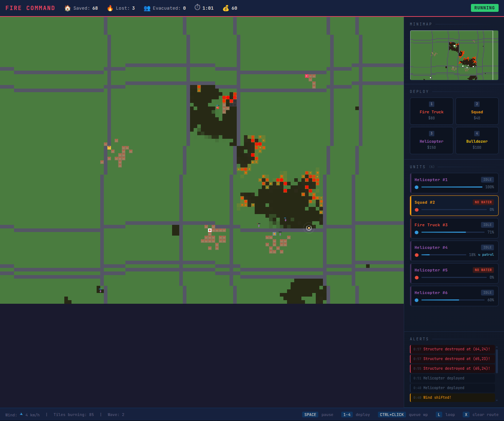

# Firefighter Commander

A real-time strategy game where you command firefighting units to contain wildfires across a procedurally generated landscape. Dispatch trucks, squads, helicopters, and bulldozers — set up patrol routes and let them operate autonomously while you focus on the big picture.

## Play

Open `index.html` in any modern browser. No build step, no dependencies — single file, pure Canvas + JS.

## Gameplay

You're the fire commander. Wildfires break out across a region of forests, villages, and critical infrastructure. You don't fight fires directly — you dispatch and coordinate units from above.

- **Pause-and-command**: Press `SPACE` to pause anytime, issue orders, then resume
- **Triage decisions**: Multiple fires rage simultaneously — you can't fight them all
- **Fire propagation**: Spreads based on terrain type, wind direction, and wind speed
- **Escalating waves**: New fires ignite over time, wind shifts, and the situation gets worse

### Units

| Unit | Key | Cost | Role |
|------|-----|------|------|
| **Fire Truck** | `1` | $80 | Main firefighting unit. Good range, high water capacity |
| **Squad** | `2` | $40 | Fast on foot. Can evacuate civilians from buildings |
| **Helicopter** | `3` | $150 | Flies over terrain. Large area water drop |
| **Bulldozer** | `4` | $100 | Clears vegetation to create firebreaks |

### Waypoint Routes

Units can follow autonomous patrol routes so you don't need to micromanage:

- **Click** — send unit to a destination
- **Ctrl+Click** — queue additional waypoints
- **L** — toggle patrol loop (unit cycles through waypoints endlessly)
- **X** — clear all waypoints

Set a truck to loop between a lake (refill) and a fire zone (fight), a bulldozer to cut a firebreak line, or squads to sweep through villages evacuating civilians.

### Map

Procedurally generated each game with:

- Dense forests and sparse woodlands (high flammability)
- Villages with houses clustered near roads
- Lakes and rivers (natural firebreaks, water refill points)
- Special buildings: hospitals, schools, fire stations, gas stations
- Roads (units move faster on roads)

Gas stations **explode** when they burn, spreading fire in a large radius.

## Controls

| Input | Action |
|-------|--------|
| `SPACE` | Pause / Resume |
| `Click` | Select unit / Send to location |
| `Right-click` | Send selected unit to location |
| `Ctrl+Click` | Queue waypoint |
| `L` | Toggle patrol loop |
| `X` | Clear route |
| `Shift+Drag` | Pan map |
| `Scroll` | Zoom in/out |
| `1` `2` `3` `4` | Select unit type to deploy |
| `ESC` | Deselect |

## Game Over

The mission fails when 60% of structures are destroyed. Your score is based on structures saved, civilians evacuated, and waves survived.

## License

MIT
